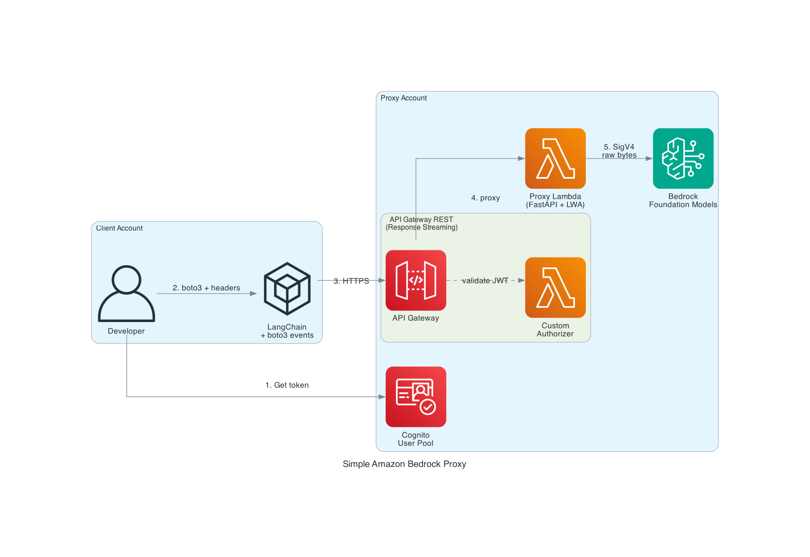

# Simple Amazon Bedrock Proxy for Enterprise Integration

Demonstrates that developers can use **LangChain** seamlessly through a Bedrock proxy by leveraging [boto3's event system](https://docs.aws.amazon.com/boto3/latest/guide/events.html) to inject custom headers into a pre-configured client. This pattern enables enterprise platforms to centrally govern, authenticate, and track AI model usage while letting developers use familiar tools like LangChain without modification.



## How It Works

1. **Client authenticates** with Cognito (client_credentials grant) and gets an access token
2. **Client creates a boto3 `bedrock-runtime` client** with `endpoint_url` pointing to the API Gateway proxy
3. **Client registers a `before-call` event handler** that injects:
   - `x-auth-token` — Cognito JWT for authorization
   - `X-Client-Workload-Id` — identifies the calling application
   - `X-Request-Tracker` — unique request correlation ID
4. **Client passes the boto3 client to LangChain's `ChatBedrockConverse`** — LangChain works with zero modifications
5. **API Gateway** validates the JWT via a Custom Lambda Authorizer
6. **Proxy Lambda** (FastAPI + Lambda Web Adapter) extracts tracking headers + model ID, logs them, then forwards raw bytes to Bedrock using SigV4-signed requests
7. **Response streaming** — Bedrock's binary event stream flows back through API Gateway (REST, `responseTransferMode: STREAM`) to the client's boto3, which parses it natively

### What Gets Tracked

The proxy Lambda logs a structured JSON entry for every request:

```json
{
  "client_id": "56hj9q63rnn...",
  "workload_id": "demo-langchain-workload",
  "request_tracker": "a1b2c3d4-...",
  "model_id": "global.anthropic.claude-sonnet-4-6",
  "operation": "converse-stream",
  "timestamp": "2026-03-02T14:30:00Z"
}
```

## Prerequisites

- AWS CLI configured with appropriate credentials
- AWS CDK CLI (`npm install -g aws-cdk`)
- Python 3.12+
- Docker (for Lambda bundling)

## Deploy

```bash
cd infra
python3 -m venv .venv && source .venv/bin/activate
pip install -r requirements.txt
cdk deploy
```

## Run the Demo

```bash
# Set environment variables from stack outputs
source scripts/setup-env.sh

# Install client dependencies and run
cd src/client
pip install -r requirements.txt
python demo.py
```

Expected output:

```
1. Authenticating with Cognito...
   Got access token.

2. Creating boto3 client with custom endpoint + headers...
   endpoint_url = https://xxx.execute-api.us-west-2.amazonaws.com/prod/
   workload_id  = demo-langchain-workload

3. Initializing LangChain ChatBedrockConverse...
   model = global.anthropic.claude-sonnet-4-6

4. Streaming response through proxy:

--------------------------------------------------
The capital of France is Paris.
--------------------------------------------------

Done. Check Lambda CloudWatch logs for tracking entries.
```

## Project Structure

```
├── infra/                        # CDK infrastructure (Python)
│   ├── app.py                    # CDK app entry point
│   └── stacks/proxy_stack.py     # Cognito + API GW + Lambdas
├── src/
│   ├── proxy/                    # Proxy Lambda (FastAPI + LWA)
│   │   ├── main.py               # FastAPI routes, tracking logs
│   │   ├── bedrock_proxy.py      # Raw byte proxy with SigV4
│   │   └── run.sh                # Lambda Web Adapter startup
│   ├── authorizer/               # Custom Authorizer Lambda
│   │   └── handler.py            # Cognito JWT validation
│   └── client/                   # Demo client (runs locally)
│       └── demo.py               # LangChain + boto3 events demo
├── scripts/
│   └── setup-env.sh              # Fetch stack outputs → env vars
└── docs/
    └── generated-diagrams/       # Architecture diagram
```

## Key Client Code

```python
import boto3
from langchain_aws import ChatBedrockConverse

# Point boto3 at the proxy instead of real Bedrock
client = boto3.client("bedrock-runtime", endpoint_url=API_GATEWAY_URL)

# Inject custom headers via boto3 event system
def add_headers(params, **kwargs):
    params["headers"]["x-auth-token"] = cognito_token
    params["headers"]["X-Client-Workload-Id"] = "my-app"
    params["headers"]["X-Request-Tracker"] = str(uuid.uuid4())

client.meta.events.register("before-call.bedrock-runtime.*", add_headers)

# LangChain works transparently — zero code changes needed
chat = ChatBedrockConverse(model="global.anthropic.claude-sonnet-4-6", client=client)
for chunk in chat.stream("Hello!"):
    print(chunk.content)
```

## Cleanup

```bash
cd infra && cdk destroy
```
